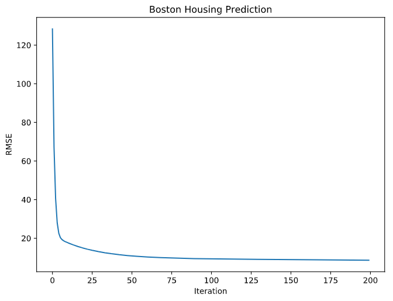
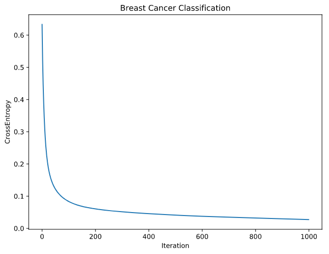

# Autograd But Smaller

TODO: add description

# Examples

```python
from autograd.tensor import Tensor

X = Tensor.uniform(shape=(100, 10))
W = Tensor.uniform(shape=(10, 1))
b = Tensor.zeros(shape=(1, 10))

linear = (X @ W + b).relu()
linear.backward()

print(X.grad, W.grad, b.grad)  # df/dX, df/dW, df/db
```

## Regression

```python
class RegNet(nn.Module):
    def __init__(self, in_features):
        super().__init__()

        self.l1 = nn.Linear(in_features, 32)
        self.l2 = nn.Linear(32, 1)

    def forward(self, X):
        out = self.l1(X).relu()
        
        return self.l2(out)


X_, y_ = load_boston()["data"], load_boston()["target"]
X, y = Tensor(X_), Tensor(y_).reshape(-1, 1)

# net training
net = RegNet(X.shape[1])
optimizer = SGD(net.parameters(), lr=1e-6)

for _ in range(500):
    net.zero_grad()
        
    loss = MSELoss(net(X), y)
    
    loss.backward()
    optimizer.step()
```



## Classification

```python
class ClassifyNet(nn.Module):
    def __init__(self, n_features, n_classes):
        super().__init__()
        
        self.l1 = nn.Linear(n_features, 32)
        self.l2 = nn.Linear(32, n_classes)
        
    def forward(self, X):
        out = self.l1(X).relu()

        return self.l2(out).softmax(axis=1)

X_, y_ = load_breast_cancer()["data"], load_breast_cancer()["target"]
X, y = Tensor(X_), validation.one_hot_encode(y_)

net = ClassifyNet(X.shape[1], n_classes=2)
optimizer = SGD(net.parameters(), lr=1e-5)

for _ in range(n_iter):
    net.zero_grad()
    
    y_pred = net(X)
    loss = CrossEntropyLoss(y_pred, y)
    
    loss.backward()
    optimizer.step()
```



# References

- https://www.jmlr.org/papers/volume18/17-468/17-468.pdf
- https://github.com/karpathy/micrograd
- http://cs231n.stanford.edu/handouts/linear-backprop.pdf